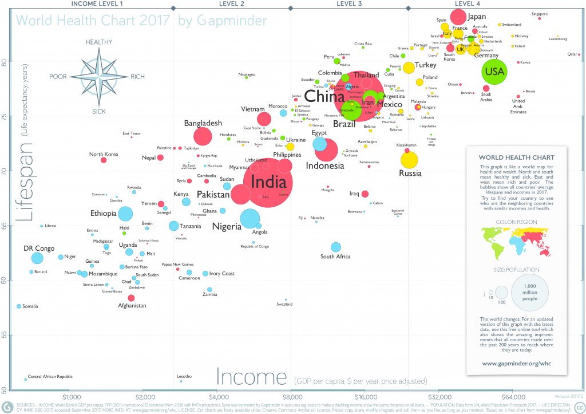

```{r echo=FALSE, message=FALSE, warning=FALSE, messages=FALSE, results='hide'}
library(ggplot2)
library(psych)
library(reshape2)
library(readxl)
library(tidyverse)
```


# Gammar of Graphics with ggplot2

* `ggplot2` is an R package that provides an alternative framework based upon Wilkinson’s (2005) Grammar of Graphics.
* `ggplot2` is, in general, more flexible for creating "prettier" and complex plots.
* Works by creating layers of different types of objects/geometries (i.e. bars, points, lines, polygons, etc.)
`ggplot2` has at least three ways of creating plots:
     1. `qplot`
     2. `ggplot(...) + geom_XXX(...) + ...`
     3. `ggplot(...) + layer(...)`
* We will focus only on the second.


---

# Parts of a ggplot2 Statement

>- Data  
`ggplot(myDataFrame, aes(x=x, y=y))`
>- Layers  
`geom_point()`, `geom_histogram()`
>- Facets  
`facet_wrap(~ cut)`, `facet_grid(~ cut)`
>- Scales  
`scale_y_log10()`
>- Other options  
`ggtitle('my title')`, `ylim(c(0, 10000))`, `xlab('x-axis label')`

---

# Lots of geoms

```{r}
ls('package:ggplot2')[grep('geom_', ls('package:ggplot2'))]
```


---
class:  center

# .left[Graphing Components: Symbols]

```{r, echo=FALSE, results='hide'}
```

```{r, echo=FALSE}
ggplot(data=data.frame(x=c(0:25))) + geom_point(size=10, aes(x=x,y=x,shape=x)) +
    facet_wrap(~ x, scales='free') + xlab('') + ylab('') +
    scale_shape_identity() +
    theme_bw() +
    theme(axis.text.x=element_blank(), axis.text.y=element_blank(),
          axis.ticks=element_blank(), legend.position='none')
```

---
class: middle, center

# .left[Graphing Components: Line Types]

```{r, echo=FALSE}
ggplot(data=data.frame(x=c(1:6))) + geom_hline(size=2, aes(yintercept=x, linetype=x)) +
    scale_linetype_identity() +
    scale_y_continuous(breaks=1:6) +
    xlab(NULL) + ylab(NULL) + xlim(c(0,100)) +
    theme_bw() +
    theme(axis.text.x=element_blank(), axis.ticks=element_blank(), legend.position='none')
```

---
class: middle, center

# .left[Graphing Components: Colors]

```{r, echo=FALSE}
#Borrowed (i.e. stollen) from http://research.stowers-institute.org/efg/R/Color/Chart/ColorChart.R
getColorHexAndDecimal <- function(color) {
    if(is.na(color)) {
        return(NA)
    } else {
        c <- col2rgb(color)
        return(sprintf("#%02X%02X%02X   %3d %3d %3d", c[1],c[2],c[3], c[1], c[2], c[3]))
    }
}

df <- data.frame(x=rep(1:26, 26), y=rep(1:26, each=26))
df$c <- NA
df[1:length(colors()),'c'] <- colors()
df <- df[!is.na(df$c),]
df$n <- NA
df[1:length(colors()),'n'] <- 1:length(colors())
df$r <- df$g <- df$b <- NA
df[1:length(colors()),c('r','g','b')] <- t(col2rgb(colors()))
df$text <- ifelse(apply(df[,c('r','g','b')], 1, sum) > (255*3/2), 'black', 'white')
df$hex <- lapply(df$c, getColorHexAndDecimal)
df$hex2 <- paste(format(df$n, width=3), format(df$c, width=(max(nchar(df$c))+1)), format(df$hex, width=(max(nchar(df$hex))+1)))

ggplot(df, aes(x=x, y=y, fill=c, label=n)) + geom_tile() + geom_text(aes(colour=text), size=3) +
    scale_fill_identity() +
    scale_colour_identity() +
    xlab(NULL) + ylab(NULL) +
    theme_bw() +
    theme(axis.text.x=element_blank(), 
          plot.margin=unit(c(0,0,0,0), "cm"),
          axis.text.y=element_blank(), 
          legend.position='none')

```

---
class: middle, center

# .left[Graphing Components: Colors]

```{r, echo=FALSE, results='hide'}
df2 <- df[!substr(df$c, 1, 4) %in% c('grey', 'gray'),]
df2 <- df2[order(df2$n),]
df2$n <- 1:nrow(df2)
```

.pull-left[
```{r, echo=FALSE, fig.width=5}
ggplot(df2[1:40,], aes(x=1, y=n, fill=c, label=hex2, colour=text)) +
    geom_tile() + geom_text(family = 'mono') +
    scale_fill_identity() +
    scale_colour_identity() +
    xlab(NULL) + ylab(NULL) +
    theme_minimal() +
    theme(axis.text.x=element_blank(), plot.margin=unit(c(0,0,0,0), "cm"),
         axis.text.y=element_blank(), legend.position='none')
```
]

.pull-right[
```{r, echo=FALSE, fig.width=5}
ggplot(df2[41:80,], aes(x=1, y=n, fill=c, label=hex2, colour=text)) +
    geom_tile() + geom_text(family = 'mono') +
    scale_fill_identity() +
    scale_colour_identity() +
    xlab(NULL) + ylab(NULL) +
    theme_minimal() +
    theme(axis.text.x=element_blank(), plot.margin=unit(c(0,0,0,0), "cm"),
         axis.text.y=element_blank(), legend.position='none')
```
]


---
class: middle, center

# .left[Graphing Components: Colors]

.pull-left[
```{r, echo=FALSE, fig.width=5}
ggplot(df2[81:120,], aes(x=1, y=n, fill=c, label=hex2, colour=text)) +
    geom_tile() + geom_text(family = 'mono') +
    scale_fill_identity() +
    scale_colour_identity() +
    xlab(NULL) + ylab(NULL) +
    theme_minimal() +
    theme(axis.text.x=element_blank(), plot.margin=unit(c(0,0,0,0), "cm"),
         axis.text.y=element_blank(), legend.position='none')
```
]

.pull-right[
```{r, echo=FALSE, fig.width=5}
ggplot(df2[121:160,], aes(x=1, y=n, fill=c, label=hex2, colour=text)) +
    geom_tile() + geom_text(family = 'mono') +
    scale_fill_identity() +
    scale_colour_identity() +
    xlab(NULL) + ylab(NULL) +
    theme_minimal() +
    theme(axis.text.x=element_blank(), plot.margin=unit(c(0,0,0,0), "cm"),
         axis.text.y=element_blank(), legend.position='none')
```
]

---
class: middle, center

# .left[Graphing Components: Colors]

.pull-left[
```{r, echo=FALSE, fig.width=5}
ggplot(df2[161:200,], aes(x=1, y=n, fill=c, label=hex2, colour=text)) +
    geom_tile() + geom_text(family = 'mono') +
    scale_fill_identity() +
    scale_colour_identity() +
    xlab(NULL) + ylab(NULL) +
    theme_minimal() +
    theme(axis.text.x=element_blank(), plot.margin=unit(c(0,0,0,0), "cm"),
         axis.text.y=element_blank(), legend.position='none')
```
]

.pull-right[
```{r, echo=FALSE, fig.width=5}
ggplot(df2[201:240,], aes(x=1, y=n, fill=c, label=hex2, colour=text)) +
    geom_tile() + geom_text(family = 'mono') +
    scale_fill_identity() +
    scale_colour_identity() +
    xlab(NULL) + ylab(NULL) +
    theme_minimal() +
    theme(axis.text.x=element_blank(), plot.margin=unit(c(0,0,0,0), "cm"),
         axis.text.y=element_blank(), legend.position='none')
```
]

---
class: middle, center

# .left[Graphing Components: Colors]

.pull-left[
```{r, echo=FALSE, fig.width=5}
ggplot(df2[241:280,], aes(x=1, y=n, fill=c, label=hex2, colour=text)) +
    geom_tile() + geom_text(family = 'mono') +
    scale_fill_identity() +
    scale_colour_identity() +
    xlab(NULL) + ylab(NULL) +
    theme_minimal() +
    theme(axis.text.x=element_blank(), plot.margin=unit(c(0,0,0,0), "cm"),
         axis.text.y=element_blank(), legend.position='none')
```
]

.pull-right[
```{r, echo=FALSE, fig.width=5}
ggplot(df2[281:320,], aes(x=1, y=n, fill=c, label=hex2, colour=text)) +
    geom_tile() + geom_text(family = 'mono') +
    scale_fill_identity() +
    scale_colour_identity() +
    xlab(NULL) + ylab(NULL) +
    theme_minimal() +
    theme(axis.text.x=element_blank(), plot.margin=unit(c(0,0,0,0), "cm"),
         axis.text.y=element_blank(), legend.position='none')
```
]

---
class: middle, center

# .left[Graphing Components: Colors]

.pull-left[
```{r, echo=FALSE, fig.width=5}
ggplot(df2[321:360,], aes(x=1, y=n, fill=c, label=hex2, colour=text)) +
    geom_tile() + geom_text(family = 'mono') +
    scale_fill_identity() +
    scale_colour_identity() +
    xlab(NULL) + ylab(NULL) +
    theme_minimal() +
    theme(axis.text.x=element_blank(), plot.margin=unit(c(0,0,0,0), "cm"),
         axis.text.y=element_blank(), legend.position='none')
```
]

.pull-right[
```{r, echo=FALSE, fig.width=5}
ggplot(df2[361:400,], aes(x=1, y=n, fill=c, label=hex2, colour=text)) +
    geom_tile() + geom_text(family = 'mono') +
    scale_fill_identity() +
    scale_colour_identity() +
    xlab(NULL) + ylab(NULL) +
    theme_minimal() +
    theme(axis.text.x=element_blank(), plot.margin=unit(c(0,0,0,0), "cm"),
         axis.text.y=element_blank(), legend.position='none')
```
]

---
class: middle, center

# .left[Graphing Components: Colors]

.pull-left[
```{r, echo=FALSE, fig.width=5}
ggplot(df2[401:440,], aes(x=1, y=n, fill=c, label=hex2, colour=text)) +
    geom_tile() + geom_text(family = 'mono') +
    scale_fill_identity() +
    scale_colour_identity() +
    xlab(NULL) + ylab(NULL) +
    theme_minimal() +
    theme(axis.text.x=element_blank(), plot.margin=unit(c(0,0,0,0), "cm"),
         axis.text.y=element_blank(), legend.position='none')
```
]

.pull-right[
```{r, echo=FALSE, fig.width=5}
ggplot(df2[441:453,], aes(x=1, y=n, fill=c, label=hex2, colour=text)) +
    geom_tile() + geom_text(family = 'mono') +
    scale_fill_identity() +
    scale_colour_identity() +
    xlab(NULL) + ylab(NULL) +
    theme_minimal() +
    theme(axis.text.x=element_blank(), plot.margin=unit(c(0,0,0,0), "cm"),
         axis.text.y=element_blank(), legend.position='none')
```
]


---

# Tutoring Data

```{r}
data(tutoring, package='TriMatch')
str(tutoring)
```

---

# Histogram

--

```{r, message=FALSE, warning=TRUE, fig.width=12, fig.height=6}
ggplot(tutoring, aes(x = Age)) + geom_histogram()
```

---

# Histogram (add in qualitative variable)

--

```{r, message=FALSE, warning=TRUE, fig.width=12, fig.height=6}
ggplot(tutoring, aes(x = Age, fill = treat)) + geom_histogram()
```

---


# Density Plot

--

```{r, message=FALSE, warning=TRUE, fig.width=12, fig.height=6}
ggplot(tutoring, aes(x = Age)) + geom_density()
```

---

# Density (add in qualitative variable)

--

```{r, message=FALSE, warning=TRUE, fig.width=12, fig.height=6}
ggplot(tutoring, aes(x = Age, color = treat)) + geom_density()
```

---

# Density (using facets)

--

```{r, message=FALSE, warning=TRUE, fig.width=12, fig.height=6}
ggplot(tutoring, aes(x = Age, fill = treat)) + geom_density() +
  facet_wrap(~ treat, ncol = 1)
```

---

# Bar Plot

--

```{r, message=FALSE, warning=TRUE, fig.width=12, fig.height=6}
ggplot(tutoring, aes(x = Course)) + geom_bar()
```

---

# Bar Plot (with treatment)

--

```{r, message=FALSE, warning=TRUE, fig.width=12, fig.height=6}
ggplot(tutoring, aes(x = Course, fill = treat)) + geom_bar()
```

---

# Bar Plot (with treatment, dodging)

--

```{r, message=FALSE, warning=TRUE, fig.width=12, fig.height=6}
ggplot(tutoring, aes(x = Course, fill = treat)) + geom_bar(position = 'dodge')
```


---

# Boxplots

--

```{r, message=FALSE, warning=TRUE, fig.width=12, fig.height=6}
ggplot(tutoring, aes(x = treat, y = GPA)) + geom_boxplot()
```

---

# Boxplots (with means)

--

```{r, message=FALSE, warning=TRUE, fig.width=12, fig.height=6}
tab <- describeBy(tutoring$GPA, tutoring$treat, mat = TRUE)
ggplot(tutoring, aes(x = treat, y = GPA)) + geom_boxplot() + 
  geom_point(data = tab, aes(x = group1, y = mean), color = 'green', size = 4)
```

---

# Violon Plots

--

```{r, message=FALSE, warning=TRUE, fig.width=12, fig.height=6}
ggplot(tutoring, aes(x = treat, y = GPA)) + geom_violin()
```


---

# Scatterplots 

Age vs GPA

--

```{r, message=FALSE, warning=TRUE, fig.width=12, fig.height=6}
ggplot(tutoring, aes(x = Age, y = GPA)) + geom_point()
```

---

# Scatterplots (add Gender)

```{r, message=FALSE, warning=TRUE, fig.width=12, fig.height=6}
ggplot(tutoring, aes(x = Age, y = GPA, color = Gender)) + geom_point()
```

---

# Summarizing null hypothesis tests

--

```{r, message=FALSE, warning=TRUE, fig.width=12, fig.height=6}
tab <- describeBy(tutoring$Grade, tutoring$treat, mat = TRUE, skew = FALSE)
tab
```

---

# Summarizing null hypothesis tests (cont.)

--

```{r, message=FALSE, warning=TRUE, fig.width=12, fig.height=6}
ggplot(tab, aes(x = group1, y = mean)) + 
  geom_errorbar(aes(ymin = mean - (1.96*se), ymax = mean + (1.96* se))) +
  geom_point(size = 3, color = 'blue')
```


---

# Gapminder




---

# Getting Started

Download the data (right click so save file as)

* [Countries](https://github.com/jbryer/EPSY887-Fall2019/blob/master/datasets/gapminder/Data%20Geographies%20-%20v1%20-%20by%20Gapminder.xlsx?raw=true)
* [Life Expectancy](https://github.com/jbryer/EPSY887-Fall2019/blob/master/datasets/gapminder/lex-by-gapminder.xlsx?raw=true)
* [Population](https://github.com/jbryer/EPSY887-Fall2019/blob/master/datasets/gapminder/Data%20Population%20-%20v5%20-%201800%20to%202100%20World%20Regions%20and%20Countries%20by%20Gapminder.xlsx?raw=true)
* [Income](https://github.com/jbryer/EPSY887-Fall2019/blob/master/datasets/gapminder/gdppc_cppp-by-gapminder.xlsx?raw=true)

Read the data into R

```{r}
countries <- read_xlsx('../datasets/gapminder/Data Geographies - v1 - by Gapminder.xlsx', 
					    sheet = 2)
life_expectancy <- read_xlsx('../datasets/gapminder/lex-by-gapminder.xlsx', 
						sheet = 2)
population <- read_xlsx('../datasets/gapminder/Data Population - v5 - 1800 to 2100 World Regions and Countries by Gapminder.xlsx',	
						sheet = 'data-countries-etc-by-year-colu')
income <- read_xlsx('../datasets/gapminder/gdppc_cppp-by-gapminder.xlsx',
					    sheet = 2)
```


---

# Data Preparation

Because life_expectancy and income have overlapping column names, we need to rename them so we can identify the columns in the merged dataset

```{r}
names(life_expectancy)[5:ncol(life_expectancy)] <- paste0('le_', 
							names(life_expectancy)[5:ncol(life_expectancy)])
names(income)[5:ncol(income)] <- paste0('income_', names(income)[5:ncol(income)])
names(population)[4:ncol(population)] <- as.character(as.integer(
              names(population)[4:ncol(population)]))
names(population)[4:ncol(population)] <- paste0('pop_', 
							names(population)[4:ncol(population)])
```

---

# Merge Tables

```{r}
gapminder <- merge(countries, 
				   life_expectancy, 
				   by = 'geo', 
				   all.x = TRUE)
gapminder <- merge(gapminder,
				   income,
				   by = 'geo', 
				   all.x = TRUE)
gapminder <- merge(gapminder,
				   population,
				   by = 'geo',
				   all.x = TRUE)
nrow(gapminder)
ncol(gapminder)
```


---

# Subset the data.frame

We'll create a variable for the year we want to look at. As we will see later, we can change this variable and create the figure for a different year quickly.


```{r}
year <- '2017' 
```

Subset the gapminder data.frame to include only the columns we are interested in.

```{r}
gapminder2 <- gapminder %>%
	rename(name = name.x) %>%
	select(geo, name, four_regions,
		   paste0('income_', year),
		   paste0('pop_', year),
		   paste0('le_', year)) %>%
	rename(income = paste0('income_', year),
		   population = paste0('pop_', year),
		   life_expectancy = paste0('le_', year))
```

---

# Income Levels

```{r}
income_levels <- c(2 * 356,
				   8 * 356,
				   32 * 356)
income_levels_df <- data.frame(
	position = c(0, income_levels),
	label = c('Level 1', 'Level 2', 'Level 3', 'Level 4')
)
```

> Level 1 is people who earn less than $2 a day and live in extreme poverty. Most people live on Level 2, where they earn between $2 and $8 a day. On Level 3, people earn between $8 and $32. The richest billion people live on Level 4, where their income is more than $32 a day (an easy way to remember the threshold for each level is by multiplying the previous number by four, so 2 – 8 – 32).<sup>1</sup>

<sup>1</sup> See https://www.gapminder.org/topics/four-income-levels/ for more information.

---

# Gapminder in ggplot2

```{r, echo=FALSE, message=FALSE, warning=FALSE, fig.width=12, fig.height=8}
ggplot(gapminder2, aes(x = income, y = life_expectancy, 
					   size = population, color = four_regions)) +
	geom_vline(xintercept = income_levels, alpha = 0.5) +
	geom_text(data = income_levels_df, aes(x = position, label = label), 
			   color = 'black', size = 3, y = 50, hjust = -0.1) +
	geom_point() +
	scale_x_log10(labels = function(x) { prettyNum(x, big.mark=',', scientific=F) }) +
	scale_color_brewer('Region', type = 'qual', palette = 6) +
	xlab('Income (GDP per capita, log transformed)') +
	ylab('Life Expectancy (in years)') +
	ggtitle('World Health Chart 2017', subtitle = 'Data Source: Gapminder') +
	theme_minimal()
```


---

# The ggplot2 expression

```{r, eval=FALSE}
ggplot(gapminder2, aes(x = income, y = life_expectancy, 
					             size = population, color = four_regions)) +
	geom_vline(xintercept = income_levels, alpha = 0.5) +
	geom_text(data = income_levels_df, 
	          aes(x = position, label = label), 
			      color = 'black', size = 3, y = 50, hjust = -0.1) +
	geom_point() +
	scale_x_log10(labels = function(x) {prettyNum(x, big.mark=',', scientific=F)}) +
	scale_color_brewer('Region', type = 'qual', palette = 6) +
	xlab('Income (GDP per capita, log transformed)') +
	ylab('Life Expectancy (in years)') +
	ggtitle('World Health Chart 2017', 
	        subtitle = 'Data Source: Gapminder') +
	theme_minimal()
```
