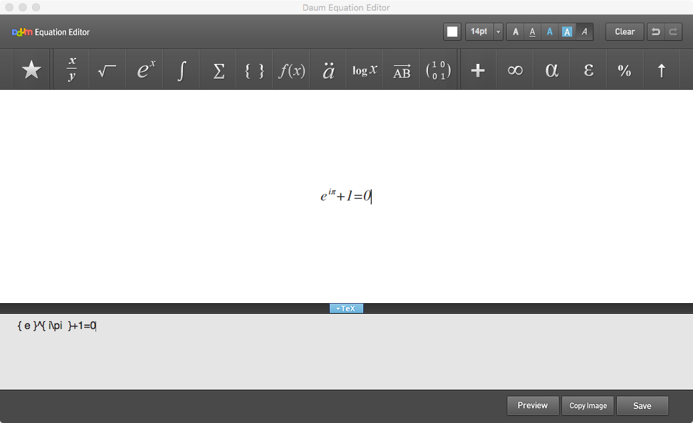
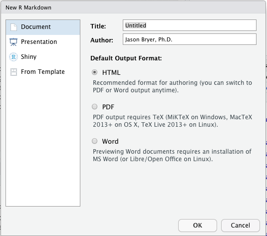

```{r echo=FALSE, message=FALSE, warning=FALSE, messages=FALSE, results='hide'}
library(markdown)
library(ggplot2)
library(psych)
library(reshape2)
library(readxl)
library(tidyverse)
library(DATA606)

data(tutoring, package='TriMatch')

mass1 <- read_xlsx('../datasets/MathAnxiety.xlsx') # Summer 2014
mass2 <- read_xlsx('../datasets/MathAnxiety.xlsx', sheet = 2) # Fall 2014
mass3 <- read_xlsx('../datasets/MathAnxiety.xlsx', sheet = 3) # Summer 2015
mass4 <- read_xlsx('../datasets/MathAnxiety.xlsx', sheet = 4) # Fall 2019
items <- c('I find math interesting.',
		   'I get uptight during math tests.',
		   'I think that I will use math in the future.',
		   'Mind goes blank and I am unable to think clearly when doing my math test.',
		   'Math relates to my life.',
		   'I worry about my ability to solve math problems.',
		   'I get a sinking feeling when I try to do math problems.',
		   'I find math challenging.',
		   'Mathematics makes me feel nervous.',
		   'I would like to take more math classes.',
		   'Mathematics makes me feel uneasy.',
		   'Math is one of my favorite subjects.',
		   'I enjoy learning with mathematics.',
		   'Mathematics makes me feel confused.')

mass1$Term <- 'Summer 2014'
mass2$Term <- 'Fall 2014'
mass3$Term <- 'Summer 2015'
mass4$Term <- 'Fall 2019'
mass <- rbind(mass1, mass2, mass3, mass4)

set.seed(2112)
```

# Getting Started

1. Create an account on Github.
2. Create a new repository: https://github.com/new
3. In [SourceTree (www.sourcetreeapp.com)](https://www.sourcetreeapp.com), click `File` -> `New`.
4. Choose "Clone from URL" (under the "New" menu).
5. Paste in the URL from the Github repository page (e.g. `https://github.com/jbryer/EPSY887-Website.git`) and click the "Clone" button.
6. Create a new RStudio project in the directory you cloned the Github repository in step 5.

---

# Markdown

Markdown is a plan text format designed primarily to be converted to HTML documents. However, with the development of [Pandoc](http://pandoc.org/), markdown has become popular for generating lots of other document formats including PDF, Word, and presentations (this presentation is, in fact, written in markdown).

The goal of markdown is for the source file (in plain text) to be readable without converting to the desired output format.

	# Level 1 Header  
	## Level 2 Header
	### Level 3 Header
	#### Level 4 Header
	##### Level 5 Header

One asterisk around a word or phrase will put it in *italics*, two will make it **bold**.

Images ``

Links `[Link text](link URL)`

See https://daringfireball.net/projects/markdown/ for more on Markdown.

---

# R Markdown


R markdown extends markdown by allowing for embedding R code and output directly within your document.

> R Markdown documents are fully reproducible. Use a productive notebook interface ⧉ to weave together narrative text and code to produce elegantly formatted output. ([RStudio Website](https://rmarkdown.rstudio.com))

```
	` ` `{r Label, options}  
	2 + 2
	` ` `
```

R code can also be included inline by placing commands between <code>&#96;r</code> and <code>&#96;</code>.

```
	A total of ` r nrow(mass)` students responded to the survey.
```

A total of `r nrow(mass)` students responded to the survey.

See https://www.rstudio.com/wp-content/uploads/2015/02/rmarkdown-cheatsheet.pdf for a cheat sheet on markdown and R markdown.

---

# Chunk Options

* `eval` (`TRUE` or `FALSE`) - whether the chunk is executed.
* `echo` (`TRUE` or `FALSE`) - whether the source code is copied into the final document.
* `message` (`TRUE` or `FALSE`) - whether messages are included in the final document.
* `warning` (`TRUE` or `FALSE`) - whether warning messages are included in the final document.
* `results` (`asis`, `hide`) - how the output should be included.
* `fig.width` - the width of any figures from the code chunk.
* `fig.height` - the height of any figures from the code chunk.
* `cache` - whether the R chunk should be cached and only updated if changed. Useful if the chunk takes a significant amount of time to run.

---

# YAML: YAML Ain't Markup Language

YAML is the markup at the beginning of the document that defines some global features of the document (e.g. author, title, date, etc.).

For HTML: https://bookdown.org/yihui/rmarkdown/html-document.html

```
---
title: Habits
author: John Doe
date: March 22, 2005
output: html_document
---
```

For PDF: https://bookdown.org/yihui/rmarkdown/pdf-document.html

```
---
title: "Habits"
author: John Doe
date: March 22, 2005
output: pdf_document
---
```

Other formats including Word, PowerPoint, manuscripts: https://rmarkdown.rstudio.com/formats.html


---

# Tables

```{r, results='asis'}
library(knitr)
tab <- describeBy(tutoring$Grade, group=tutoring$treat, mat=TRUE, skew=TRUE)
tab <- tab[,c('group1', 'n', 'mean', 'sd', 'median')]
names(tab) <- c('Treatment', 'n', 'Mean', 'Standard Deviation', 'Median')
kable(tab, row.names=FALSE, digits=3, 
	  caption='Descriptive Statistics for Grade by Treatment', 
	  format='html')
```

---

# Math Equations



R Markdown uses [MathJax](https://www.mathjax.org/) to display math equations. MathJax is an open source JavaScript library that converts LaTeX style equations to HTML. Thanks to Daum Equation Editor available as a [Google Chrome Extension](https://www.google.com/url?sa=t&rct=j&q=&esrc=s&source=web&cd=1&cad=rja&uact=8&ved=0CB4QFjAAahUKEwifg8qolurIAhXI6CYKHWqzBUE&url=https%3A%2F%2Fchrome.google.com%2Fwebstore%2Fdetail%2Fdaum-equation-editor%2Fdinfmiceliiomokeofbocegmacmagjhe%3Fhl%3Den&usg=AFQjCNHN4YwIK4t7cZnjtAURGPzFadCONQ&sig2=Lvsf0JzDQFCECAoMIYIo8A) or as a [Mac Application](https://www.google.com/url?sa=t&rct=j&q=&esrc=s&source=web&cd=3&cad=rja&uact=8&ved=0CDAQFjACahUKEwifg8qolurIAhXI6CYKHWqzBUE&url=https%3A%2F%2Fitunes.apple.com%2Fus%2Fapp%2Fdaum-equation-editor%2Fid540665783%3Fmt%3D12&usg=AFQjCNH69beGYAfr5ojnPILLNOG-goN9sw&sig2=MwUV_3iF8zb0BQDNL7sBgQ), creating equations is relatively simply using a graphical user interface. Math equations are surrounded by one dollar sign for inline equations or two dollar signs for centered equations.


<pre class='prettyprint lang-r'>
$$ { e }^{ i\pi  }+1=0 $$
</pre>

$$ { e }^{ i\pi  }+1=0 $$

---

# Your Turn: Create a New R Markdown File

In RStudio:



1. Click `File` -> `New File` -> `R Markdown`
2. Fill in the contents of the dialog box:
3. Click the `Knit` button.

Try some other formats, including a slide show.

---

# Blogdown

Blogdown is an R package to facilitate creating websites using R and R Markdown. The backend engine/framework is [Hugo](https://gohugo.io). The following two commands will install the Blogdown package and install the Hugo web engine. Hugo is a static website generator. That is, the websites Hugo generates does not require any code execution on the server, therefore resulting in much faster websites. The downside, however, is there is minimal interactivity.

```{r, eval=FALSE}
install.packages('blogdown')
blogdown::install_hugo()
```

To create a new site in the current working directory (use the `dir` parameter to change this):

```{r, eval=FALSE}
blogdown::new_site()
```

---

# File Structure

The resulting website will have the following files and folders:

* `config.toml` - [Configuration file for the entire website](https://bookdown.org/yihui/blogdown/configuration.html).
* `content/` - [This is where the pages of your website will be created including pages and posts](https://bookdown.org/yihui/blogdown/content.html).
* `static/` - Any static content (e.g. images) can be placed here. Files in this directory will be copied to the generated website.
* `themes/` - Website themes are placed here. See [themes.gohugo.io](https://themes.gohugo.io) for sample themes.
* `layouts/` - Customizations to the theme are placed here.


---

# Your Turn: Create a new Blogdown Website

Creating the website (change the directory and theme as you like):


```{r, eval=FALSE}
blogdown::new_site(dir='my_website', theme='aerohub/hugo-orbit-theme')
```

Building the website (note that by default the website is built into the `public` directory):

```{r, eval=FALSE}
blogdown::build_site()
```

Starting and stopping the Hugo webserver:

```{r, eval=FALSE}
blogdown::serve_site()
blogdown::stop_server()
```


---

# Publishing Your Website

There are a number of options for where to deploy your website as outlined in the [Blogdown book](https://bookdown.org/yihui/blogdown/deployment.html). We will use [Github Pages](https://pages.github.com) to deploy our website. You will also need to download [SourceTree](https://www.sourcetreeapp.com).

Github Pages allows static websites to be published for each repository. The easiest way to publish a website is to publish the website content into the `docs/` directory of the repository. Hugo, by defualt, publishes to the `public` folder. However, the `publishDir` parameter in the `config.toml` file can override this setting.

```
publishDir = "docs/"
```

Once the site is built, you can push your changes to Github using the Sourcetree application.

You need to update your repository settings to tell Github to publish the website in the `docs` directory (got to `https://github.com/GITHUB_USERNAME/MY-REPOSITORY/settings`). Under the *Github Pages* heading, set the source option to: "master branch /docs folder".

---

# Bookdown

Bookdown (see [bookdown.org](https://bookdown.org)) is another package to facilitate writing books or long form documents. Bookdown can generate both HTML websites as well as output to PDF, Word, epub, and LaTeX.

```{r, eval=FALSE}
install.packages('bookdown')
```

---

# LaTeX

> LaTeX is a high-quality typesetting system; it includes features designed for the production of technical and scientific documentation. LaTeX is the de facto standard for the communication and publication of scientific documents. [LaTeX Website](https://www.latex-project.org)

In general, you will not write using LaTeX directly (with the exception of math equations). However, when using R markdown to generate PDFs, R will create an intermediate LaTeX file which necessitates having LaTeX installed. The [tinytex](https://yihui.name/tinytex/) package provides an easy interface for installing LaTeX.

```{r, eval=FALSE}
install.packages('tinytex')
tinytex::install_tinytex()
```


---

# Resources

* [Intro to Markdown](https://daringfireball.net/projects/markdown/)
* [R Markdown](https://rmarkdown.rstudio.com)
* [R Markdown Cheat Sheet](http://www.rstudio.com/wp-content/uploads/2015/02/rmarkdown-cheatsheet.pdf)
* [Blogdown Book](https://bookdown.org/yihui/blogdown/)
* [Hugo Themes](https://themes.gohugo.io)
* [Bookdown](https://bookdown.org)
* [Bookdown Book](https://bookdown.org/yihui/bookdown/)

Some examples of my websites:

* [Course website](https://epsy887.bryer.org) - built using blogdown using the [Techdoc theme](https://themes.gohugo.io/hugo-theme-techdoc/); [Repository](https://github.com/jbryer/EPSY887-Fall2019)
* [My CV](https://cv.bryer.org/) - built using blogdown and the [Orbit theme](https://themes.gohugo.io/hugo-orbit-theme/); [Reposistory](https://github.com/jbryer/CV)
* [Personal Website](http://www.bryer.org) - built using blogdown and the [academic theme](https://themes.gohugo.io/academic/); [Repository](https://github.com/jbryer/bryer_org)
* [Propensity Score Analysis](http://jbryer.github.io/psa/) built using bookdown; [Repository](https://github.com/jbryer/psa)
