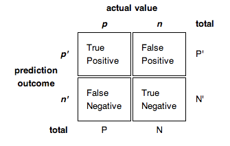

```{r install, eval=FALSE, include=FALSE}
# Install libraryd packages
install.packages(c('tidyverse', "titanic", 'tree', 'party', 
				   'randomForest', 'randomForestExplainer',
				   'mice', 'ROCR', 'devtools', 'tidymodels', 'caret'))
devtools::install_github('jbryer/TriMatch')
devtools::install_github("thomasp85/patchwork")
```

<style>
div.footnotes {
  position: absolute;
  bottom: 0;
  margin-bottom: 10px;
  width: 80%;
  font-size: 0.6em;
}
.forceBreak { -webkit-column-break-after: always; break-after: column; }
</style>
<!-- Use for forced two column break: <p class="forceBreak"></p> -->

<script src="https://ajax.googleapis.com/ajax/libs/jquery/3.1.1/jquery.min.js"></script>
<script>
$(document).ready(function() {
  $('slide:not(.backdrop):not(.title-slide)').append('<div class=\"footnotes\">');

  $('footnote').each(function(index) {
    var text  = $(this).html();
    var fnNum = (index+1).toString();
    $(this).html(fnNum.sup());

    var footnote   = fnNum + '. ' + text + '<br/>';
    var oldContent = $(this).parents('slide').children('div.footnotes').html();
    var newContent = oldContent + footnote;
    $(this).parents('slide').children('div.footnotes').html(newContent);
  });
});
</script>

```{r setup, include=FALSE}
# knitr::opts_chunk$set(echo = FALSE)
library(tree)
library(rpart)
library(party)
library(randomForest)
library(randomForestExplainer)
library(ggplot2)
library(mice)
library(ROCR)
library(TriMatch)
library(tidymodels)
library(caret)
library(patchwork)
library(ROCR)

par(mfrow = c(1,1), xpd = NA) #To prevent text from being clipped
par(bg="white", mai=c(1.2,1.5,1,1))

```

## Agenda

* What is predictive modeling?
	* Training and validation matrices
	* Confusion matrices
	* ROC curves
* Classification and Regression Trees (CART)
* Ensemble methods
* Issues and limitations of predictive modeling

<br /><br /><br /><br />

# Overview

## What is Predictive Modeling?

> "Predictive modelling uses statistics to predict outcomes. Most often the event one wants to predict is in the future, but predictive modelling can be applied to any type of unknown event, regardless of when it occurred. For example, predictive models are often used to detect crimes and identify suspects, after the crime has taken place." ([Wikipedia](https://en.wikipedia.org/wiki/Predictive_modelling))


## Basic Steps of Predictive Modeling<footnote>Adapted from Kuhn's rstudio::conf(2019) conference workshop: https://github.com/topepo/rstudio-conf-2019</footnote>

* Estimate model parameters (i.e. training models)
* Determine the values of tuning parameters that cannot be directly calculated from the data
* Model selection
	* Within model type - typically uses *n*-fold validation
	* Between model types - typically uses a validation dataset
* Calculate the performance of the final model that will generalize to new data


## Working with Data

Data is typically split into two data sets:

* **Training Set** - the data used to train predictions models (e.g. model estimation, tuning parameters, etc.)
* **Validation Set** - a separate data set used to assess the efficacy of the model. These data *should not* be used during the training phase.

Although there are not established guidelines as to the size of these data sets, randomly selected between 20% and 25% of the data set to "set aside" for validation is typical. The more data we spend on training, the better the model estimates will (often) be.

**Stratified Sampling**

It is generally advisable to stratify the selection of the training and validation data sets to ensure they are representative of the total sample.

* For **classification** models stratify on the outcome.
* For **regression** models stratify on the quintiles (or similar).

## Splitting

```{r}
set.seed(2112)
titanic <- read.csv('data/titanic3.csv', stringsAsFactors = FALSE)
```

```{r imputeTitanic, include=FALSE, message=FALSE, warning=FALSE, cache=TRUE}
titanic$sex <- as.factor(titanic$sex)
titanic.mice <- mice::mice(titanic[,c("pclass","sex","age","sibsp")], m=1)
titanic <- cbind(survived=titanic$survived, mice::complete(titanic.mice))
```

```{r}
titanic.split <- rsample::initial_split(titanic, strata = 'survived')
titanic.train <- rsample::training(titanic.split)
titanic.valid <- rsample::testing(titanic.split)

calif <- read.table('data/cadata.dat', header=TRUE)
price.quintiles <- quantile(calif$MedianHouseValue, props = seq(0, 1, 0.2))
calif$cut.prices <- cut(calif$MedianHouseValue, price.quintiles, include.lowest=TRUE)
calif.split <- rsample::initial_split(calif, strata = 'cut.prices')
calif.train <- rsample::training(calif.split)
calif.valid <- rsample::testing(calif.split)
```

## Outcome Distributions: Titanic

```{r, fig.width = 10}
p1 <- ggplot(titanic.train, aes(x = survived, y = (..count..)/sum(..count..))) +
	geom_bar(fill = 'red') + ylab('Percent Training')
p2 <- ggplot(titanic.valid, aes(x = survived, y = (..count..)/sum(..count..))) +
	geom_bar(fill = 'blue') + ylab('Percent Testing')
p1 + p2 + plot_layout(ncol = 2)
```

## Outcome Distributions: California Housing

```{r, fig.width = 10}
ggplot(calif.train, aes(x = MedianHouseValue)) + 
	geom_density(color = 'red') + 
	geom_density(data = calif.valid, color = 'blue')
```

## V-Fold Cross Validation

We split the data into V distinct blocks then:

1. Leave the first block out and train with the remaining data.
2. The held-out block is used to evaluate the model.
3. Repeat steps 1 and 2 until all blocks have been used for validation.

We use the average across all models as the final performance for this model.

V is typically 5 or 10 depending on the data size.s


## 10-Fold Cross-Validation with *n* = 50 {.centered}

```{r, echo = FALSE, fig.width = 10, fig.height = 5}
n <- 50
fold10 <- data.frame(id = 1:n)
fold10$Fold <- rep(1:10)
fold10$InTrain <- sample(rep(1:10, n / 10))
for(i in 1:10) {
	fold10[,paste0('Fold', i)] <- ifelse(fold10$InTrain == i, 'Assessment', 'Analysis')
}
fold10.melt <- melt(fold10[,-c(2:3)], id = 'id', variable.name = 'Fold', value.name = 'Test')
ggplot(fold10.melt, aes(x = Fold, y = id, fill = Test)) + 
	geom_tile() + 
	scale_fill_brewer('Data used for') +
	xlab('') +
	theme_bw()
```


## Logistic Regression: Titanic

```{r}
titanic.lr <- glm(survived ~ pclass + sex + age + sibsp,
       data=titanic.train,
       family=binomial(logit))
```

## Logistic Regression: Titanic

```{r}
summary(titanic.lr)
```

## Evaluating Model Accuracy

```{r}
lr.valid <- predict(titanic.lr, 
					newdata = titanic.valid,
					type = 'response')
tab <- table(lr.valid > 0.5, titanic.valid$survived) %>% prop.table * 100
tab
```

Our total prediction accuracy is `r round(tab[1,1] + tab[2,2], digits=1)`% (reminder that `r round(sum(titanic$survived) / nrow(titanic) * 100, digits = 1)`% of passengers survived).

# CART Methods


## Classification and Regression Trees

The goal of CART methods is to find best predictor in X of some outcome, y. CART methods do this recursively using the following procedures:

* Find the best predictor in X for y.
* Split the data into two based upon that predictor.
* Repeat 1 and 2 with the split data sets until a stopping criteria has been reached.

There are a number of possible stopping criteria including: Only one data point remains.

* All data points have the same outcome value.
* No predictor can be found that sufficiently splits the data.

## Recursive Partitioning Logic of CART {.columns-2}

Consider the scatter plot to the right with the following characteristics:

* Binary outcome, G, coded “A” or “B”.
* Two predictors, x and z
* The vertical line at z = 3 creates the first partition.
* The double horizontal line at x = -4 creates the second partition.
* The triple horizontal line at x = 6 creates the third partition.


## Tree Structure {.columns-2}

* The root node contains the full data set.
* The data are split into two mutually exclusive pieces. Cases where x > ci go to the right, cases where x <= ci go to the left.
* Those that go to the left reach a terminal node.
* Those on the right are split into two mutually exclusive pieces. Cases where z > c2 go to the right and terminal node 3; cases where z <= c2 go to the left and terminal node 2.


## Sum of Squared Errors

The sum of squared errors for a tree *T* is:

$$S=\sum _{ c\in leaves(T) }^{  }{ \sum _{ i\in c }^{  }{ { (y-{ m }_{ c }) }^{ 2 } }  }$$

Where, ${ m }_{ c }=\frac { 1 }{ n } \sum _{ i\in c }^{  }{ { y }_{ i } }$, the prediction for leaf \textit{c}.

Or, alternatively written as:

$$S=\sum _{ c\in leaves(T) }^{  }{ { n }_{ c }{ V }_{ c } }$$

Where $V_{c}$ is the within-leave variance of leaf \textit{c}.

Our goal then is to find splits that minimize S.

## Advantages of CART Methods

* Making predictions is fast.
* It is easy to understand what variables are important in making predictions.
* Trees can be grown with data containing missingness. For rows where we cannot reach a leaf node, we can still make a prediction by averaging the leaves in the sub-tree we do reach.
* The resulting model will inherently include interaction effects. There are many reliable algorithms available.

## Regression Trees

In this example we will predict the median California house price from the house’s longitude and latitude.

```{r}
str(calif)
```

## Tree 1 {.centered}

```{r}
treefit <- tree(log(MedianHouseValue) ~ Longitude + Latitude, data=calif)
plot(treefit); text(treefit, cex=0.75)
```

## Tree 1 {.centered}

```{r, echo=FALSE, fig.width=8, fig.height=5.6}
price.deciles <- quantile(calif$MedianHouseValue, 0:9/9)
cut.prices <- cut(calif$MedianHouseValue, price.deciles, include.lowest=TRUE)
plot(calif$Longitude, calif$Latitude, col=grey(10:2/11)[cut.prices], pch=20, 
	 xlab="Longitude", ylab="Latitude")
partition.tree(treefit, ordvars=c("Longitude","Latitude"), add=TRUE)
```

## Tree 1

```{r}
summary(treefit)
```

Here “deviance” is the mean squared error, or root-mean-square error of $\sqrt{.166} =  0.41$.

## Tree 2, Reduce Minimum Deviance

We can increase the fit but changing the stopping criteria with the mindev parameter.

```{r}
treefit2 <- tree(log(MedianHouseValue) ~ Longitude + Latitude, data=calif, mindev=.001)
summary(treefit2)
```

With the larger tree we now have a root-mean-square error of 0.32.

## Tree 2, Reduce Minimum Deviance {.centered}

```{r, echo=FALSE, fig.width=8, fig.height=5.6}
plot(calif$Longitude, calif$Latitude, col=grey(10:2/11)[cut.prices], 
pch=20, xlab="Longitude", ylab="Latitude")
partition.tree(treefit2, ordvars=c("Longitude","Latitude"), add=TRUE)
```

## Tree 3, Include All Variables

However, we can get a better fitting model by including the other variables.

```{r}
treefit3 <- tree(log(MedianHouseValue) ~ ., data=calif)
summary(treefit3)
```

With all the available variables, the root-mean-square error is 0.11.

## Classification Trees

* `pclass`: Passenger class (1 = 1st; 2 = 2nd; 3 = 3rd)
* `survival`: A Boolean indicating whether the passenger survived or not (0 = No; 1 = Yes); this is our target
* `name`: A field rich in information as it contains title and family names
* `sex`: male/female
* `age`: Age, a significant portion of values are missing
* `sibsp`: Number of siblings/spouses aboard
* `parch`: Number of parents/children aboard
* `ticket`: Ticket number.
* `fare`: Passenger fare (British Pound).
* `cabin`: Does the location of the cabin influence chances of survival?
* `embarked`: Port of embarkation (C = Cherbourg; Q = Queenstown; S = Southampton)
* `boat`: Lifeboat, many missing values
* `body`: Body Identification Number
* `home.dest`: Home/destination

## Classification using `rpart`

```{r}
(titanic.rpart <- rpart(survived ~ pclass + sex + age + sibsp,
   data=titanic.train))
```

## Classification using `rpart`

```{r}
plot(titanic.rpart); text(titanic.rpart, use.n=TRUE, cex=1)
```

## Classification using `ctree`

```{r}
(titanic.ctree <- ctree(survived ~ pclass + sex + age + sibsp, data=titanic.train))
```

## Classification using `ctree`

```{r}
plot(titanic.ctree)
```


## Receiver Operating Characteristic (ROC) Graphs {.columns-2}

In a classification model, outcomes are either as positive (*p*) or negative (*n*). There are then four possible outcomes:

* **true positive** (TP) The outcome from a prediction is *p* and the actual value is also *p*.
* **false positive** (FP) The actual value is *n*.
* **true negative** (TN) Both the prediction outcome and the actual value are *n*.
* **false negative** (FN) The prediction outcome is *n* while the actual value is *p*.

<br/>



##  {.centered}


## `ROCR` Package {.columns-2}

```{r eval=FALSE, fig.height=4.5, fig.width=4.5, include=TRUE}
titanic.pred <- predict(titanic.ctree)
pred <- prediction(titanic.pred, 
			as.integer(titanic.train$survived))
perf <- performance(pred, 
			measure="tpr",
			x.measure="fpr")
plot(perf, colorize=TRUE, 
			yaxis.at=c(0,0.5,0.8,0.9,1), 
			yaxis.las=1)
lines(c(0,1), c(0,1), col="grey")
```

<p class="forceBreak"></p>

```{r, echo=FALSE, fig.width=4.5, fig.height=4.5}
titanic.pred <- predict(titanic.ctree)
pred <- prediction(titanic.pred, 
			as.integer(titanic.train$survived))
perf <- performance(pred, 
			measure="tpr",
			x.measure="fpr")
plot(perf, colorize=TRUE, 
			yaxis.at=c(0,0.5,0.8,0.9,1), 
			yaxis.las=1)
lines(c(0,1), c(0,1), col="grey")
```


# Ensemble Methods

## Ensemble Methods

Ensemble methods use multiple models that are combined by weighting, or averaging, each individual model to provide an overall estimate. Each model is a random sample of the sample. Common ensemble methods include:

* *Boosting* - Each successive trees give extra weight to points incorrectly predicted by earlier trees. After all trees have been estimated, the prediction is determined by a weighted “vote” of all predictions (i.e. results of each individual tree model).
* *Bagging* - Each tree is estimated independent of other trees. A simple “majority vote” is take for the prediction.
* *Random Forests* - In addition to randomly sampling the data for each model, each split is selected from a random subset of all predictors.
* *Super Learner* - An ensemble of ensembles. See https://cran.r-project.org/web/packages/SuperLearner/vignettes/Guide-to-SuperLearner.html

## Random Forests

The random forest algorithm works as follows:

1 Draw $n_{tree}$ bootstrap samples from the original data.

2 For each bootstrap sample, grow an unpruned tree. At each node, randomly sample $m_{try}$ predictors and choose the best split among those predictors selected<footnote>Bagging is a special case of random forests where $m_{try} = p$ where *p* is the number of predictors</footnote>.

3 Predict new data by aggregating the predictions of the ntree trees (majority votes for classification, average for regression).

Error rates are obtained as follows:

1 At each bootstrap iteration predict data not in the bootstrap sample (what Breiman calls “out-of-bag”, or OOB, data) using the tree grown with the bootstrap sample.

2 Aggregate the OOB predictions. On average, each data point would be out-of-bag 36% of the times, so aggregate these predictions. The calculated error rate is called the OOB estimate of the error rate.

## Random Forests: Titanic

```{r titanicRF, cache=TRUE}
titanic.rf <- randomForest(factor(survived) ~ pclass + sex + age + sibsp,
						   data = titanic.train,
						   ntree = 5000,
						   importance = TRUE)
```

```{r}
print(titanic.rf)
importance(titanic.rf)
```

## Random Forests: Titanic

```{r randomForestExplainer, cache=TRUE}
min_depth_frame <- min_depth_distribution(titanic.rf)
```


```{r, fig.width = 10, fig.height=4}
plot_min_depth_distribution(min_depth_frame)
```


# caret Package

## The `caret` Package

```
The caret package (short for _C_lassification _A_nd _RE_gression _T_raining)
is a set of functions that attempt to streamline the process for creating
predictive models. 
```

The `caret` package creates a unified interface for using many modeling packages. 

| Function   | Package      | Code
|------------|--------------|---------------------------------------------------
| lda        | MASS         | predict(obj)
| glm	     | stats        | predict(obj, type = "response")
| gbm        | gbm          | predict(obj, type = "response", n.trees)
| mda        | mda          | predict(obj, type = "posterior")
| rpart      | rpart        | predict(obj, type = "prob")
| Weka       | RWeka        | predict(obj, type = "probability")
| logitboost | LogitBoost   | predict(obj, type = "raw", nIter)


## Tutoring Example: Data Preparation

```{r}
data("tutoring")
tutoring$treat2 <- as.factor(tutoring$treat != 'Control')

inTrain <- createDataPartition(
	y = tutoring$treat2,
	## the outcome data are needed
	p = .75,
	## The percentage of data in the
	## training set
	list = FALSE
)

tutoring.train <- tutoring[inTrain,]
tutoring.valid <- tutoring[-inTrain,]
```

## Tutoring Example: Training with Random Forests

```{r caretRF, message=FALSE, warning=FALSE, cache=TRUE}
rfFit <- train(
	treat2 ~ Gender + Ethnicity + Military + ESL + EdMother + EdFather + 
		Age + Employment + Income + Transfer + GPA,
	data = tutoring.train,
	method = "parRF"
)
rfFit
```

## Tutoring Example: Validation of Random Forests

```{r}
rf.valid.pred <- predict(rfFit, newdata = tutoring.valid)
confusionMatrix(rf.valid.pred, tutoring.valid$treat2)
```

## Tutoring Example: Training with Naive Bayes

```{r caretBayes, cache=TRUE}
bayesFit <- train(
	treat2 ~ Gender + Ethnicity + Military + ESL + EdMother + EdFather + 
		Age + Employment + Income + Transfer + GPA,
	data = tutoring.train,
	method = "naive_bayes"
)
```

## Tutoring Example: Validation of Naive Bayes

```{r}
bayes.valid.pred <- predict(bayesFit, newdata = tutoring.valid)
confusionMatrix(bayes.valid.pred, tutoring.valid$treat2)
```

# Discussion

## Considerations for Predictive Modeling {.build}

**Feature Engineering**

* What variables should be transformed (e.g. recoded, log transformed, elimination of predictors, centered, scaled, etc.)?
* What to do with missing data (e.g. impute)?
* Would conducting a principal component analysis help?
* Are there interaction effects between some variables?

**Are your predictions actually any good?** 

[Loh, Soo, and Xing](http://cs229.stanford.edu/proj2016/report/LohSooXing-PredictingSexualOrientationBasedOnFacebookStatusUpdates-report.pdf) (2016) were able to predict one's sexual orientation with approximately 90% accuracy. However, according to [Gallop](https://news.gallup.com/poll/201731/lgbt-identification-rises.aspx), only 4.1% of American identify as LGTBQ. If I were to guess every American was heterosexual I would be correct 95.9% of the time, doing better than the Loh, Soo, and Xing's predictive models.

**Are your predictions reinforcing social biases?**

* [When it Comes to Gorillas, Google Photos Remains Blind (Wired)](https://www.wired.com/story/when-it-comes-to-gorillas-google-photos-remains-blind/)
* [How Amazon Accidentally Invented a Sexist Hiring Algorithm (Inc.)](https://www.inc.com/guadalupe-gonzalez/amazon-artificial-intelligence-ai-hiring-tool-hr.html)

## Additional Resources

Kuhn and Johnson's *Applied Predictive Modeling*

* Website: http://appliedpredictivemodeling.com/
* Workshop Materials: https://github.com/topepo/rstudio-conf-2019
* `caret` package: http://topepo.github.io/caret

`randomForestExplainer`: https://cran.rstudio.com/web/packages/randomForestExplainer/vignettes/randomForestExplainer.html

`SuperLearner` package: https://github.com/ecpolley/SuperLearner

Ferndández-Delgado, Cernadas, Barro, & Amorin (2014). [Do we Need Hundreds of Classifiers to Solve Real World
Classification Problems?](http://jmlr.org/papers/volume15/delgado14a/delgado14a.pdf) *Journal of Machine Learning Research, 15*, 3133-3181


## Thank You!

### Jason Bryer, Ph.D.  

Email: jason@bryer.org  
Twitter: [@jbryer](https://twitter.com/@jbryer)  
Website:  https://www.bryer.org  
Github: https://github.com/jbryer  
