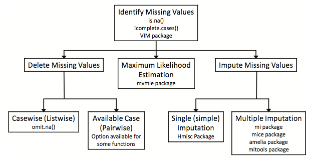
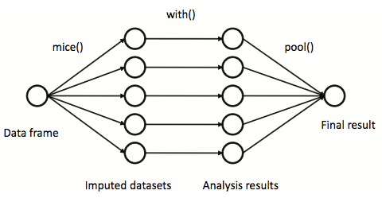

```{r install, eval=FALSE, include=FALSE}
# Install libraryd packages
install.packages(c('mice','VIM','ggplot2'))
```

<style>
div.footnotes {
  position: absolute;
  bottom: 0;
  margin-bottom: 10px;
  width: 80%;
  font-size: 0.6em;
}
.forceBreak { -webkit-column-break-after: always; break-after: column; }
</style>
<!-- Use for forced two column break: <p class="forceBreak"></p> -->

<script src="https://ajax.googleapis.com/ajax/libs/jquery/3.1.1/jquery.min.js"></script>
<script>
$(document).ready(function() {
  $('slide:not(.backdrop):not(.title-slide)').append('<div class=\"footnotes\">');

  $('footnote').each(function(index) {
    var text  = $(this).html();
    var fnNum = (index+1).toString();
    $(this).html(fnNum.sup());

    var footnote   = fnNum + '. ' + text + '<br/>';
    var oldContent = $(this).parents('slide').children('div.footnotes').html();
    var newContent = oldContent + footnote;
    $(this).parents('slide').children('div.footnotes').html(newContent);
  });
});
</script>

```{r setup, include=FALSE}
require(ggplot2)
require(grid)
require(VIM)
require(mice)

```

# Evaluating the Nature of Missingness

## Classifications of Missing Data

* **MCAR** - Missing completely at random if the events that lead to any particular data-item being missing are independent both of observable variables and of unobservable parameters of interest, and occur entirely at random. When data are MCAR, the analysis performed on the data is unbiased; however, data are rarely MCAR.

* **MAR** - Missing at random occurs when the missingness is not random, but where missingness can be fully accounted for by variables where there is complete information.

* **NMAR** - Not missing at random (also known as nonignorable nonresponse) is data that is neither MAR nor MCAR (i.e. the value of the variable that's missing is related to the reason it's missing).

<!-- Source: Wikipedia https://en.m.wikipedia.org/wiki/Missing_data -->


## Methods for Handling Missing Data <footnote>Kabacoff, 2011, p. 355</footnote> {.centered}




## Mammal Sleep Data {.columns-2}

Allison, T. & Chichetti, D. (1976). [Sleep in mammals: ecological and constitutional correlates.](https://pdfs.semanticscholar.org/8d4f/202354bf0fd1bd445792340e16acc042ec6d.pdf) *Science 194* (4266), 732–734.

**Abstract** *The interrelationships between sleep, ecological, and constitutional variables were assessed statistically for 39 mammalian species. Slow-wave sleep is negatively associated with a factor related to body size, which suggests that large amounts of this sleep phase are disadvantageous in large species. Paradoxical sleep is associated with a factor related to predatory danger, which suggests that large amounts of this sleep phase are disadvantageous in prey species.*


<p class="forceBreak"></p>


* <font size='3'>`BodyWgt` - Body weight in kilograms</font>
* <font size='3'>`BrainWgt` - Brain weight in grams</font>
* <font size='3'>`NonD` - Non-dreaming sleep (hours / day)</font>
* <font size='3'>`Dream` - Dreaming sleep (hours / day)</font>
* <font size='3'>`Sleep` - Total sleep</font>
* <font size='3'>`Span` - Life-span in years</font>
* <font size='3'>`Gest` - Gestation time in days</font>
* <font size='3'>`Pred` - Prediction index: 1 = minimum (least likely to be preyed upon) to 5 = maximum (most likely to be preyed upon)</font>
* <font size='3'>`Exp` - Sleep exposure index: 1 = least exposed (e.g. animal sleeps in a well-protected den) to 5 = most exposed</font>
* <font size='3'>`Danger` - Overall danger index (based on the above two indices and other information): 1 = least danger (from other animals) to 5 = most danger (from other animals)</font>

## Mammal Sleep Data

```{r}
data(sleep, package="VIM")
str(sleep)
```


## Complete Cases

```{r}
complete.cases(sleep)
head(sleep[complete.cases(sleep),])
```


## Incomplete Cases

```{r}
head(sleep[!complete.cases(sleep),])
```


## How much is missing?

Number of missing values

```{r}
sum(is.na(sleep$Dream))
```

Percent missing

```{r}
mean(is.na(sleep$Dream))
```

Percent of rows with missing data

```{r}
mean(!complete.cases(sleep))
```


## Pattern of Missingness

```{r,fig.width=10,fig.height=5.5}
md.pattern(sleep, rotate.names = TRUE)
```


## Visualizing Missingness

```{r fig-aggr,fig.width=10,fig.height=5}
aggr(sleep, prop=FALSE, numbers=TRUE)
```


## Visualizing Missingness


```{r fig-matrixplot,fig.width=10,fig.height=5}
matrixplot(sleep)
```


## Visualizing Missingness

```{r fig-marginplot,fig.width=10,fig.height=5}
marginplot(sleep[,c('Gest','Dream')], pch=c(20), col=c('darkgray','red','blue'))
```


## Shadow Matrix

```{r}
sm <- as.data.frame(abs(is.na(sleep)))
head(sleep)
head(sm)
```


## Correlation of Missingness

Examine the correlation of missingness between variables

```{r}
# Extract varabibles that have any missingness
y <- sm[which(sapply(sm, sd) > 0)] 
cor(y)
```


## Relationship between missingness and observed variables

```{r warning=FALSE}
cor(sleep, y, use='pairwise.complete.obs')
```

Rows are observed variables, columns missing indicators. Non-dreaming (`NonD`) sleep scores are more likely to be missing with larger body weights (`BodyWgt`) with r=0.227. Since the correlations are not very large suggests that the nature of the missingness deviates minimally from the MCAR and MAR assumptions.


## Understanding missingness

Kabacoff (2011, p. 362) suggests the following questions to address:

* What percentage of the data is missing?
* Is it concentrated in a few variables, or widely distributed?
* Does it appear to be random?
* Does the covariation of missing data with each other or with the observed data suggest a possible mechanism that's producing the missing values.


## Options for analyzing data with missing values

* Complete case analysis (listwise deletion) - Use the `na.omit` function to remove any rows with missing values. 
* Pairwise deletion
* Multiple imputation
* Simple imputation - replace values with a single value (e.g. mean, median, mode)


# Imputing Missing Values

## Multiple Imputation


First introduced by Rubin (1987) as way of handling missing data. Steps for multiple imputation: 

1. Impute the missing values by using an appropriate model which incorporates random variation.

2. Repeat the first step multiple times (typically 5 to 10 times is sufficient).

3. Perform the desired analysis on each imputed dataset.

4. Pool the results from step 3.

The most common approach is multiple imputation by chained equations (MICE). This has been shown to work very well when data is missing at random, but also in when data is missing not at random ([Sulis, Porcu, & Mariano, 2017](https://link.springer.com/article/10.1007%2Fs00357-017-9220-3)).


See volume 45 of the *Journal of Statistical Software* which is a special volume on multiple imputation: http://www.jstatsoft.org/v45/.


## Steps for Multiple Imputation <footnote>Kabacoff, 2011, p. 366</footnote> {.centered}





## Imputing

Using the `mice` package to impute missing values.

```{r, warning=FALSE}
imp <- mice(sleep, printFlag=FALSE, seed=1234)
imp
```

## Checking Distributions of Imputed Values

If we assume the data is MCAR, then the imputations should have the same distribution as the observed data.

```{r,fig.width=10,fig.height=4}
stripplot(imp, Dream~.imp, pch=20, cex=2)
```

## Checking Distributions of Imputed Values

```{r,fig.width=10,fig.height=5}
stripplot(imp)
```


## Getting Complete Dataset

```{r}
dataset5 <- complete(imp, 5)
head(dataset5)
```


## Pooling the imputed datasets

```{r}
fit <- with(imp, lm(Dream ~ Span + Gest))
pooled <- pool(fit) 
summary(pooled)
```

# Not Missing at Random

## How much missingness across groups matters?

```{r}
data(lalonde, package='Matching')
Tr <- lalonde$treat
X <- lalonde[,c('age','educ','black','hisp','married','nodegr','re74','re75')]
lalonde.glm <- glm(treat ~ ., family=binomial, data=cbind(treat=Tr, X))
summary(lalonde.glm)
```


## Data Preparation

Create a copy of the covariates to simulate missing at random (mar) and not missing at random (nmar).

```{r}
lalonde.mar <- X
lalonde.nmar <- X
missing.rate <- .2                  # What percent of rows will have missing data
missing.cols <- c('nodegr', 're75') # The columns we will add missing values to
missing.ratio <- 1.5                # Ratio of missingness for treatment-to-control
```

Vectors indicating which rows are treatment and control.

```{r}
treat.rows <- which(lalonde$treat == 1)
control.rows <- which(lalonde$treat == 0)
```

Add missingness to the existing data. For the not missing at random data treatment units will have twice as many missing values as the control group.

```{r}
for(i in missing.cols) {
	lalonde.mar[sample(nrow(lalonde), nrow(lalonde) * missing.rate), i] <- NA
	lalonde.nmar[sample(treat.rows, length(treat.rows) * missing.rate * missing.ratio), i] <- NA
	lalonde.nmar[sample(control.rows, length(control.rows) * missing.rate), i] <- NA
}
```

## Proportion of missing values

For our data missing at random.

```{r}
prop.table(table(is.na(lalonde.mar[,missing.cols[1]]), Tr, useNA='ifany'), 2)
```

For our data not missing at random.

```{r}
prop.table(table(is.na(lalonde.nmar[,missing.cols[1]]), Tr, useNA='ifany'), 2)
```

## Multiple Imputation

Create a shadow matrix. This is a logical vector where each cell is TRUE if the value is missing in the original data frame.

```{r}
shadow.matrix.mar <- as.data.frame(is.na(lalonde.mar[,missing.cols,drop=FALSE]))
shadow.matrix.nmar <- as.data.frame(is.na(lalonde.nmar[,missing.cols,drop=FALSE]))
```

Change the column names to include "_miss" in their name.

```{r}
names(shadow.matrix.mar) <- names(shadow.matrix.nmar) <- paste0(names(shadow.matrix.mar), '_miss')
```

Impute the missing values using the mice package

```{r}
mice.mar <- mice(lalonde.mar, m=1, printFlag=FALSE, seed = 2112)
mice.nmar <- mice(lalonde.nmar, m=1, printFlag=FALSE, seed = 2112)
```

Get the imputed data set.

```{r}
complete.mar <- complete(mice.mar)
complete.nmar <- complete(mice.nmar)
```

## Check the regression results (MAR)

```{r}
lalonde.mar.glm <- glm(treat~., data=cbind(treat=Tr, complete.mar, shadow.matrix.mar))
summary(lalonde.mar.glm)
```

## Check the regression results (NMAR)

```{r}
lalonde.nmar.glm <- glm(treat~., data=cbind(treat=Tr, complete.nmar, shadow.matrix.nmar))
summary(lalonde.nmar.glm)
```

## 

```{r, echo=FALSE, results='hide',fig.width=10,fig.height=6}
missing.cols <- c('nodegr')
results <- data.frame(ratio=seq(1, 2, by=.05), stringsAsFactors=FALSE)
for(i in missing.cols) { results[,i] <- NA }
for(j in 1:nrow(results)) {
	missing.ratio <- results[j,]$ratio
	lalonde.mar <- X
	lalonde.nmar <- X
	
	# Vectors indiciating which rows are treatment and control.
	treat.rows <- which(lalonde$treat == 1)
	control.rows <- which(lalonde$treat == 0)
	
	# Add missingness to the existing data. For the not missing at random data 
	# treatment units will have twice as many missing values as the control group.
	for(i in missing.cols) {
		lalonde.mar[sample(nrow(lalonde), nrow(lalonde) * missing.rate), i] <- NA
		lalonde.nmar[sample(treat.rows, length(treat.rows) * missing.rate * missing.ratio), i] <- NA
		lalonde.nmar[sample(control.rows, length(control.rows) * missing.rate), i] <- NA
	}
	
	# Create a shadow matrix. This is a logical vector where each cell is TRUE if the
	# value is missing in the original data frame.
	shadow.matrix.mar <- as.data.frame(is.na(lalonde.mar))
	shadow.matrix.nmar <- as.data.frame(is.na(lalonde.nmar))
	
	# Change the column names to include "_miss" in their name.
	names(shadow.matrix.mar) <- names(shadow.matrix.nmar) <- paste0(names(shadow.matrix.mar), '_miss')
	
	# Impute the missing values using the mice package
	mice.mar <- mice(lalonde.mar, m=1, printFlag=FALSE)
	mice.nmar <- mice(lalonde.nmar, m=1, printFlag=FALSE)
	
	# Get the imputed data set.
	complete.mar <- complete(mice.mar)
	complete.nmar <- complete(mice.nmar)
	
	# Estimate the propensity scores using logistic regression.
	lalonde.mar.glm <- glm(treat~., data=cbind(treat=Tr, complete.mar, shadow.matrix.mar))
	lalonde.nmar.glm <- glm(treat~., data=cbind(treat=Tr, complete.nmar, shadow.matrix.nmar))
	
	# We see that the two indicator columns from the shadow matrix are statistically
	# significant predictors suggesting that the data is not missing at random.
	sum.mar <- summary(lalonde.mar.glm)
	sum.nmar <- summary(lalonde.nmar.glm)
	for(i in missing.cols) {
		results[j,i] <- sum.nmar$coefficients[paste0(i, '_missTRUE'),4]
	}
}

tmp <- melt(results, id='ratio', value.name='p.value')

ggplot(tmp, aes(x=ratio, y=p.value, group=variable, color=variable)) + 
	geom_point(size = 1) +
	geom_path() +
	geom_hline(yintercept=0.05, color='blue') +
	geom_text(label="p = 0.05", x=1.9, y=.05, color='blue', vjust=-0.3, size=4) +
	geom_hline(yintercept=0.1, color='blue') +
	geom_text(label="p = 0.1", x=1.9, y=.1, color='blue', vjust=-0.3, size=4) +
	geom_hline(yintercept=0.5, color='blue') +
	geom_text(label="p = 0.5", x=1.9, y=.5, color='blue', vjust=-0.3, size=4) +
	scale_x_continuous(breaks=seq(1, 2, .1)) +
	xlab('Ratio of missingness (treatment-to-control)') +
	ylab('p-value')
```

## 

```{r, echo=FALSE, results='hide',fig.width=10,fig.height=6}
missing.cols <- c('nodegr', 're75') # The columns we will add missing values to
results <- data.frame(ratio=seq(1, 2, by=.05), stringsAsFactors=FALSE)
for(i in missing.cols) { results[,i] <- NA }
for(j in 1:nrow(results)) {
	missing.ratio <- results[j,]$ratio
	lalonde.mar <- X
	lalonde.nmar <- X
	
	# Vectors indiciating which rows are treatment and control.
	treat.rows <- which(lalonde$treat == 1)
	control.rows <- which(lalonde$treat == 0)
	
	# Add missingness to the existing data. For the not missing at random data 
	# treatment units will have twice as many missing values as the control group.
	for(i in missing.cols) {
		lalonde.mar[sample(nrow(lalonde), nrow(lalonde) * missing.rate), i] <- NA
		lalonde.nmar[sample(treat.rows, length(treat.rows) * missing.rate * missing.ratio), i] <- NA
		lalonde.nmar[sample(control.rows, length(control.rows) * missing.rate), i] <- NA
	}
	
	# Create a shadow matrix. This is a logical vector where each cell is TRUE if the
	# value is missing in the original data frame.
	shadow.matrix.mar <- as.data.frame(is.na(lalonde.mar))
	shadow.matrix.nmar <- as.data.frame(is.na(lalonde.nmar))
	
	# Change the column names to include "_miss" in their name.
	names(shadow.matrix.mar) <- names(shadow.matrix.nmar) <- paste0(names(shadow.matrix.mar), '_miss')
	
	# Impute the missing values using the mice package
	mice.mar <- mice(lalonde.mar, m=1, printFlag=FALSE)
	mice.nmar <- mice(lalonde.nmar, m=1, printFlag=FALSE)
	
	# Get the imputed data set.
	complete.mar <- complete(mice.mar)
	complete.nmar <- complete(mice.nmar)
	
	# Estimate the propensity scores using logistic regression.
	lalonde.mar.glm <- glm(treat~., data=cbind(treat=Tr, complete.mar, shadow.matrix.mar))
	lalonde.nmar.glm <- glm(treat~., data=cbind(treat=Tr, complete.nmar, shadow.matrix.nmar))
	
	# We see that the two indicator columns from the shadow matrix are statistically
	# significant predictors suggesting that the data is not missing at random.
	sum.mar <- summary(lalonde.mar.glm)
	sum.nmar <- summary(lalonde.nmar.glm)
	for(i in missing.cols) {
		results[j,i] <- sum.nmar$coefficients[paste0(i, '_missTRUE'),4]
	}
}

tmp <- melt(results, id='ratio', value.name='p.value')

ggplot(tmp, aes(x=ratio, y=p.value, group=variable, color=variable)) + 
	geom_point(size = 1) +
	geom_path() +
	geom_hline(yintercept=0.05, color='blue') +
	geom_text(label="p = 0.05", x=1.9, y=.05, color='blue', vjust=-0.3, size=4) +
	geom_hline(yintercept=0.1, color='blue') +
	geom_text(label="p = 0.1", x=1.9, y=.1, color='blue', vjust=-0.3, size=4) +
	geom_hline(yintercept=0.5, color='blue') +
	geom_text(label="p = 0.5", x=1.9, y=.5, color='blue', vjust=-0.3, size=4) +
	scale_x_continuous(breaks=seq(1, 2, .1)) +
	xlab('Ratio of missingness (treatment-to-control)') +
	ylab('p-value')
```

# Discussion

## Additional Resources

* [Wikipedia article](https://en.wikipedia.org/wiki/Missing_data)
* [VIM Vignette](https://cran.r-project.org/web/packages/VIMGUI/vignettes/VIM-Imputation.pdf)
* `mice` package website: https://stefvanbuuren.name/mice/
* `mitools` package: http://cran.cnr.berkeley.edu/web/packages/mitools/index.html
* Rubin, D. (1987). [*Multiple Imputation for Nonresponse in Surveys*](https://onlinelibrary.wiley.com/doi/pdf/10.1002/9780470316696.fmatter). New York: John Wiley & Sons.
* Gelman and Hill's chapter on missing data: http://www.stat.columbia.edu/~gelman/arm/missing.pdf
* Azur, M. J., Stuart, E. A., Frangakis, C., & Leaf, P. J. (2011). [Multiple imputation by chained equations: what is it and how does it work?](https://www.ncbi.nlm.nih.gov/pmc/articles/PMC3074241/). *International journal of methods in psychiatric research, 20*(1), 40–49. doi:10.1002/mpr.329
